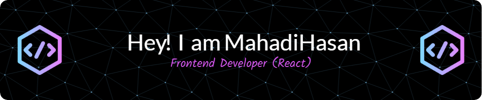

 
<!-- [.;Thank+you+for+visiting!>)](https://git.io/typing-svg) -->

<h1 align="center">
  
</h1>

##  About Me:

  Hi, I'm Mahadi Hasan, Frontend focused MERN Stack Developer from Bangladesh.
   
   
  👨‍🎓 I'm currently exploring - Nextjs & Typescript
   
  💻 I love Writing code, problem-solving and learning anything new about them 😊
   
  📚 I’m currently focused on Backend Development 
   
   
  📫 How to reach me 👇

     

<h2 align="center">🔥 Languages & Frameworks & Tools & Abilities 🔥
</h2>
 

## :chart_with_upwards_trend: Current Stats

  

<h2 align="center">⚡Language Stats ⚡</h2>
 

<h2 align="center">💹 Most Popular Repos 💹</h2>
 

<!--  -->

